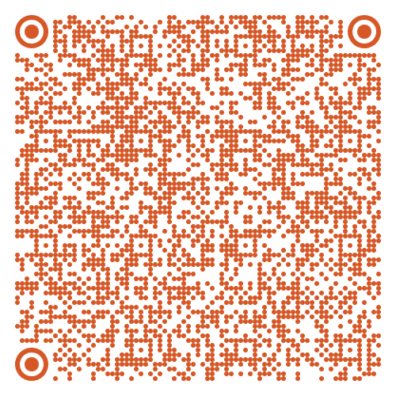

2026-05-22

Only few days left until the Rathayatra festival…

And today we want to sincerely appeal to each of you. 🙏

The Rathayatra festival in Vilnius is not a commercial event. It happens only thanks to people's kindness, support, and donations. Every stage, every feast, music, procession, decorations, and the entire festive atmosphere exists because someone decides to contribute.

This year's Rathayatra budget – EUR 13,000.  
Currently raised – EUR 10,200.  
With only few days left until the festival, to reach our goal, we need to collect at least EUR 270 every day.  

We really want to create a beautiful, warm, and inspiring festival for everyone – with a concert, cultural program, festive procession, vegetarian feasts, and an atmosphere that touches people's hearts.

However, without your contribution, this simply won't happen.

Therefore, we kindly ask you – if you can, please contribute with a donation. Whether it is 5, 10, 50, or more euros – every donation is extremely important and brings us closer to making the festival a reality. 🙏

Support the Rathayatra 2026 Festival
(payment purpose: Rathayatra 2026):
Recipient: Vilniaus Krišnos sąmonės religinė bendruomenė
Swedbank: LT177300010118511925
SEB: LT107044060001303307
PaySera: EVP6810001965033

Or directly via Paysera (by clicking the button or scanning the QR code):

    <a href="https://www.paysera.com/pay/?data=cHJvamVjdGlkPTI1NzQ2OCZvcmRlcmlkPTAmYW1vdW50PSZjdXJyZW5jeT1FVVImYWNjZXB0dXJsPWh0dHBzJTNBJTJGJTJGZ2F1cmFuZ2EubHQmY2FuY2VsdXJsPWh0dHBzJTNBJTJGJTJGZ2F1cmFuZ2EubHQmY2FsbGJhY2t1cmw9JnRlc3Q9MCZ2ZXJzaW9uPTEuNg==&sign=ca738d71cf9fcd98f674c19e8531e497" id="donateBtnSample" target="_blank" rel="noopener noreferrer">
        
        Support
    </a>

Or simply by clicking this link: https://www.paypal.com/donate/...  

Also, you can support through Contribee platform: <a href="https://contribee.com/lt/rathajatravilnius/post/102072" target="_blank" rel="noopener noreferrer">Support via Contribee</a>

We invite you to become a part of this beautiful celebration and together create something special for Vilnius.

